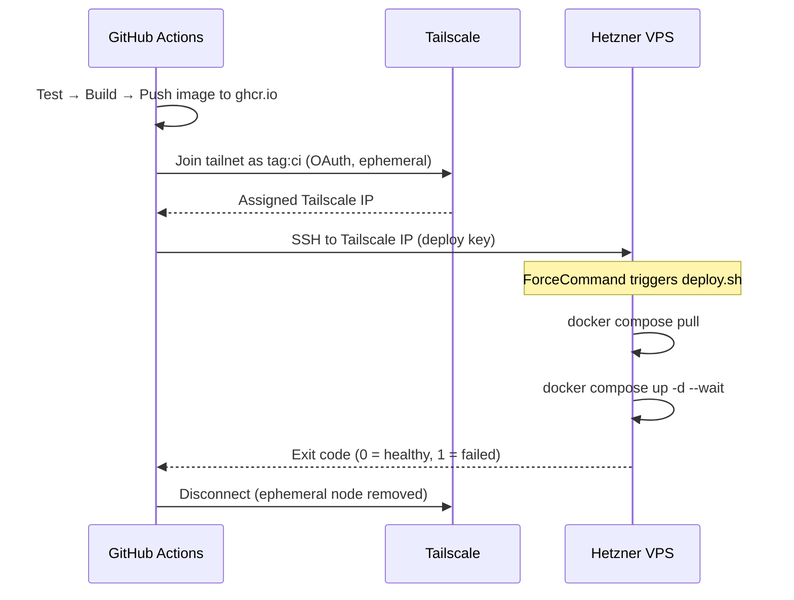

# Hetzner VPS Hardening Guide

Checklist for securing a fresh Ubuntu VPS running Docker (Caddy reverse proxy + app containers) with CI/CD deploying via SSH from GitHub Actions.

**Execution order matters.** Steps are numbered in the order they should be run. In particular, Docker must be installed before the DOCKER-USER iptables patch can be applied.

## 0. Update the system ✅

```bash
apt update && apt upgrade -y && reboot
```

## 1. Hetzner Cloud Firewall ✅

Do this first in the Hetzner console. This is the most important layer because **Docker bypasses UFW** by manipulating iptables directly. The Hetzner cloud firewall operates at the network level upstream of the host — Docker can't touch it.

### How to create it

1. Log in to [Hetzner Cloud Console](https://console.hetzner.cloud/)
2. Select your project
3. Go to **Firewalls** in the left sidebar (under Networking)
4. Click **Create Firewall**
5. Give it a name (e.g. `alexandria-fw`)
6. Delete any default inbound rules Hetzner pre-populates
7. Add these **inbound rules**:

| Protocol | Port | Source | Purpose |
|----------|------|--------|---------|
| TCP | 22 | Your IP(s) only | SSH |
| TCP | 80 | Any | HTTP (Caddy ACME HTTP-01 challenges) |
| TCP | 443 | Any | HTTPS |
| UDP | 443 | Any | HTTP/3 QUIC |

Port 22 is restricted to your IP(s). CI/CD deploys reach the server over Tailscale (private network), not the public internet — see [Tailscale for CI/CD](#tailscale-for-cicd) below. UFW also allows SSH on the `tailscale0` interface (`sudo ufw allow in on tailscale0 to any port 22`).

For the HTTP/HTTPS/QUIC rules, leave source as `Any` (0.0.0.0/0 and ::/0).

8. Leave **outbound rules** as the default (allow all) — required for APT, Docker Hub pulls, and Caddy ACME
9. Under **Apply to**, select your VPS server
10. Click **Create Firewall**

Everything not explicitly allowed is denied by default. The firewall takes effect immediately — no reboot needed.

> **Verify it's attached:** After creation, go to your server's **Networking** tab in the console. The firewall should appear under "Firewalls". If it's not listed, the rules aren't active.

> **Caddy + ACME:** Caddy's automatic HTTPS needs outbound access to Let's Encrypt and inbound port 80 for HTTP-01 challenges. If you tighten outbound rules later, whitelist the ACME provider or certificate renewal will break silently.

> **Lockout recovery:** If you lose access (IP change, key loss), use the Hetzner web console (VNC) to log in directly — it bypasses the network firewall and SSH entirely. You can also temporarily edit the cloud firewall rules to re-allow your new IP.

## 2. Create users and project directories ✅

Create project directories first — the deploy script (below) references them:

```bash
mkdir -p /opt/alexandria /opt/caddy
```

```bash
# Admin user
adduser eamon
usermod -aG sudo eamon
mkdir -p /home/eamon/.ssh
cp /root/.ssh/authorized_keys /home/eamon/.ssh/authorized_keys
chown -R eamon:eamon /home/eamon/.ssh
chmod 700 /home/eamon/.ssh && chmod 600 /home/eamon/.ssh/authorized_keys

# CI/CD deploy user (no sudo, no shell login needed)
adduser --disabled-password --gecos "" deploy
mkdir -p /home/deploy/.ssh
chmod 700 /home/deploy/.ssh
chown -R deploy:deploy /home/deploy/.ssh
```

Set directory ownership — only the app directory is writable by deploy. Caddy config stays root-owned to limit blast radius if the deploy key is compromised:

```bash
chown deploy:deploy /opt/alexandria
chown root:root /opt/caddy
```

Generate the deploy keypair locally:

```bash
ssh-keygen -t ed25519 -C "github-actions-deploy" -f ~/.ssh/alexandria_deploy
```

Install the public key with `restrict` plus a `command=` restriction:

```bash
# On the server, as root:
DEPLOY_PUB="ssh-ed25519 AAAA... github-actions-deploy"  # paste your actual public key
echo "restrict,command=\"/home/deploy/deploy.sh\" $DEPLOY_PUB" \
  > /home/deploy/.ssh/authorized_keys
chmod 600 /home/deploy/.ssh/authorized_keys
chown deploy:deploy /home/deploy/.ssh/authorized_keys
```

> The `restrict` keyword disables all SSH features (port forwarding, agent forwarding, PTY allocation, X11, user rc files) in a single flag. Only the forced command is allowed.

Create the deploy script (`/home/deploy/deploy.sh`) that the key is restricted to:

```bash
#!/bin/bash
set -euo pipefail
cd /opt/alexandria
docker compose pull && docker compose up -d --wait --remove-orphans
```

```bash
chmod 755 /home/deploy/deploy.sh
chown deploy:deploy /home/deploy/deploy.sh
```

Store the private key as a GitHub Actions secret (`SSH_PRIVATE_KEY`). Also store the server's host key fingerprint — see [CI/CD host key verification](#cicd-host-key-verification) below.

> **Why `command=` + `restrict`?** A compromised GitHub Actions workflow (dependency supply chain attack, leaked secret) would otherwise get a full interactive shell as the `deploy` user. The `command=` restriction means the key can only execute the deploy script, regardless of what the SSH client requests. `restrict` ensures no tunneling, PTY, or other capabilities are available even if the command restriction were somehow bypassed.

## 3. SSH hardening ✅

In `/etc/ssh/sshd_config`:

```
PermitRootLogin no
PasswordAuthentication no
PubkeyAuthentication yes
KbdInteractiveAuthentication no
X11Forwarding no
AllowTcpForwarding no
AllowAgentForwarding no
AllowUsers eamon deploy
MaxAuthTries 3
LoginGraceTime 20

Match User deploy
    PermitTTY no
    ForceCommand /home/deploy/deploy.sh
    AllowTcpForwarding no
    AllowAgentForwarding no
    X11Forwarding no
```

The `Match User deploy` block enforces restrictions at the sshd level, independent of the `authorized_keys` `restrict` keyword. Belt and suspenders — if someone replaces the authorized_keys file, sshd still forces the command and denies interactive access.

```bash
sshd -t                    # validate config BEFORE restarting
systemctl restart ssh
```

**Test in a second terminal before closing your current session.** Verify `eamon` can connect and get a shell. Only after confirming access, lock root:

```bash
passwd -l root
```

> **Order matters:** Lock root only after you've verified SSH works for your admin user in a separate session. If SSH is misconfigured and root is locked, your only recovery path is the Hetzner VNC console.

### CI/CD host key verification ✅

The VPS host key is stored as a GitHub Actions secret (`SSH_KNOWN_HOSTS`) and written to `~/.ssh/known_hosts` in the deploy workflow. The key was scanned from the VPS's Tailscale IP (not the public IP) since CI/CD connects over Tailscale.

To re-scan if the host key changes (e.g. OS reinstall):
```bash
# On the VPS:
ssh-keyscan -t ed25519 $(tailscale ip -4)
# Set the output (replacing localhost with the Tailscale IP) as SSH_KNOWN_HOSTS in GitHub Actions secrets
```

### Tailscale for CI/CD ✅

GitHub Actions runners connect to the VPS over Tailscale instead of the public internet. This keeps port 22 restricted to the admin's IP in the Hetzner Cloud Firewall — no public SSH exposure for CI/CD.



**Setup:**
1. Install Tailscale on the VPS: `curl -fsSL https://tailscale.com/install.sh | sh && sudo tailscale up`
2. Join the `alexandria-reader` org tailnet
3. Tag the VPS as `tag:server` in the Tailscale admin console
4. Create an OAuth client (Settings → Trust credentials) with `Devices → Core → Write` scope and `tag:ci`
5. UFW rule to allow SSH on the Tailscale interface: `sudo ufw allow in on tailscale0 to any port 22`

**ACL policy** (Access controls → JSON editor):
```json
{
  "tagOwners": {
    "tag:ci": ["autogroup:admin"],
    "tag:server": ["autogroup:admin"]
  },
  "acls": [
    {"action": "accept", "src": ["autogroup:member"], "dst": ["*:*"]},
    {"action": "accept", "src": ["tag:ci"], "dst": ["tag:server:22"]}
  ]
}
```

**GitHub Actions secrets:**
| Secret | Value |
|--------|-------|
| `TS_OAUTH_CLIENT_ID` | Tailscale OAuth client ID |
| `TS_OAUTH_SECRET` | Tailscale OAuth client secret |
| `TAILSCALE_IP` | VPS Tailscale IP (`tailscale ip -4` on VPS) |
| `DEPLOY_SSH_KEY` | Deploy key private key |
| `SSH_KNOWN_HOSTS` | Host key at Tailscale IP |
| `SERVER_USER` | `deploy` |

## 4. Install Docker ✅

Install Docker early because the DOCKER-USER iptables chain (step 7) doesn't exist until Docker is running.

```bash
sudo apt install -y ca-certificates curl gnupg
sudo install -m 0755 -d /etc/apt/keyrings
curl -fsSL https://download.docker.com/linux/ubuntu/gpg | sudo tee /etc/apt/keyrings/docker.asc > /dev/null
sudo chmod a+r /etc/apt/keyrings/docker.asc

echo "deb [arch=$(dpkg --print-architecture) signed-by=/etc/apt/keyrings/docker.asc] \
  https://download.docker.com/linux/ubuntu $(. /etc/os-release && echo "$VERSION_CODENAME") stable" \
  | sudo tee /etc/apt/sources.list.d/docker.list > /dev/null

sudo apt update
sudo apt install -y docker-ce docker-ce-cli containerd.io docker-buildx-plugin docker-compose-plugin
```

Add the deploy user to the docker group:

```bash
sudo usermod -aG docker deploy
```

> **Risk: `docker` group ≈ root.** Membership in the `docker` group grants unrestricted access to the Docker daemon — a user can mount the host filesystem and escalate to root (`docker run -v /:/host -it ubuntu chroot /host`). This is acceptable here because the deploy key is locked to a single `command=` script via both `authorized_keys` and `sshd_config ForceCommand`, and `deploy` has no sudo or interactive shell access. If your threat model changes, consider rootless Docker or a socket proxy like [docker-socket-proxy](https://github.com/Tecnativa/docker-socket-proxy).

## 5. Docker daemon hardening ✅

Create `/etc/docker/daemon.json`:

```json
{
  "live-restore": true,
  "no-new-privileges": true,
  "log-driver": "json-file",
  "log-opts": {
    "max-size": "10m",
    "max-file": "3"
  }
}
```

```bash
sudo systemctl restart docker
```

| Setting | Purpose |
|---------|---------|
| `live-restore` | Keeps containers running during Docker daemon restarts/upgrades |
| `no-new-privileges` | Prevents container processes from gaining additional privileges via setuid/setgid |
| `log-driver` + `log-opts` | Prevents container logs from filling the disk — rotates at 10 MB x 3 files per container |

## 6. UFW ✅

Verify IPv6 support is enabled (should be the default):

```bash
grep -q '^IPV6=yes' /etc/default/ufw || echo "WARNING: IPv6 not enabled in UFW"
```

```bash
sudo apt install -y ufw
sudo ufw default deny incoming
sudo ufw default allow outgoing
sudo ufw allow from YOUR_IP to any port 22 proto tcp    # match Hetzner firewall SSH restriction
sudo ufw allow 80/tcp
sudo ufw allow 443/tcp
sudo ufw allow 443/udp
sudo ufw enable
```

> **Defense-in-depth:** The SSH restriction here mirrors the Hetzner cloud firewall rule. Even if someone misconfigures the cloud firewall, UFW still blocks SSH from unauthorized IPs. Replace `YOUR_IP` with the same IP(s) used in step 1.

## 7. Fix Docker + UFW bypass ✅

Docker manipulates iptables directly and inserts its own chains (`DOCKER`, `DOCKER-USER`) that are evaluated before UFW's rules. A container with `-p 8080:8080` will be publicly reachable even when `ufw deny 8080` is set. Two fixes:

### A. Never publish app ports publicly (required) TODO

This is the primary defense. In compose files, app containers should either not bind host ports at all (Caddy reaches them via Docker network), or bind to loopback only:

```yaml
ports:
  - "127.0.0.1:3001:3001"  # only accessible from host
```

Only Caddy gets real port bindings (80/443). This is simple, reliable, and doesn't depend on iptables hacks.

### B. Patch the DOCKER-USER iptables chain (secondary)

Additional safety net. Append to `/etc/ufw/after.rules`:

```
# BEGIN UFW AND DOCKER
*filter
:ufw-user-forward - [0:0]
:ufw-docker-logging-deny - [0:0]
:DOCKER-USER - [0:0]
-A DOCKER-USER -j ufw-user-forward
-A DOCKER-USER -j RETURN -s 10.0.0.0/8
-A DOCKER-USER -j RETURN -s 172.16.0.0/12
-A DOCKER-USER -j RETURN -s 192.168.0.0/16
-A DOCKER-USER -p udp -m udp --sport 53 --dport 1024:65535 -j RETURN
-A DOCKER-USER -j ufw-docker-logging-deny -p tcp -m tcp --tcp-flags FIN,SYN,RST,ACK SYN -d 192.168.0.0/16
-A DOCKER-USER -j ufw-docker-logging-deny -p tcp -m tcp --tcp-flags FIN,SYN,RST,ACK SYN -d 10.0.0.0/8
-A DOCKER-USER -j ufw-docker-logging-deny -p tcp -m tcp --tcp-flags FIN,SYN,RST,ACK SYN -d 172.16.0.0/12
-A DOCKER-USER -j RETURN
-A ufw-docker-logging-deny -m limit --limit 3/min --limit-burst 10 -j LOG --log-prefix "[UFW DOCKER BLOCK] "
-A ufw-docker-logging-deny -j DROP
COMMIT
# END UFW AND DOCKER
```

```bash
# ufw reload is unreliable for after.rules chain injection — cycle UFW instead:
sudo ufw disable && sudo ufw enable
```

Do **not** set `"iptables": false` in Docker daemon config — it breaks container networking.

> **Known limitation:** These rules block new inbound TCP connections (SYN packets) to container IPs on private subnets, but the final `-j RETURN` means established connections and non-TCP traffic (UDP) to container IPs pass through to Docker's own rules. This is a known constraint of the [ufw-docker](https://github.com/chaifeng/ufw-docker) approach. For this setup it's acceptable because: (a) the Hetzner cloud firewall blocks unexpected inbound traffic at the network level before it reaches the host, and (b) app containers don't publish ports (strategy A above).

## 8. Fail2ban ✅

SSH is already IP-restricted at two layers (Hetzner firewall + UFW), so fail2ban is a tertiary defense here. It's still worth running — it's cheap and handles the case where firewall rules are temporarily relaxed.

```bash
sudo apt install -y fail2ban
sudo cp /etc/fail2ban/jail.conf /etc/fail2ban/jail.local
```

In `/etc/fail2ban/jail.local`, set the `[sshd]` section:

```ini
[sshd]
enabled = true
port = ssh
backend = systemd    # required on Ubuntu 24.04 — logs go to journal, not /var/log/auth.log
maxretry = 3
findtime = 10m
bantime = 1h
```

```bash
sudo systemctl enable --now fail2ban
sudo fail2ban-client status sshd   # verify
```

## 9. Unattended security upgrades ✅

```bash
sudo apt install -y unattended-upgrades
sudo dpkg-reconfigure -plow unattended-upgrades
```

In `/etc/apt/apt.conf.d/50unattended-upgrades`:

```
Unattended-Upgrade::Automatic-Reboot "true";
Unattended-Upgrade::Automatic-Reboot-Time "03:00";
```

### Graceful container shutdown before reboot

Automatic reboots will kill running containers abruptly. Create a systemd service to stop containers cleanly before shutdown:

```bash
sudo tee /etc/systemd/system/docker-compose-app.service > /dev/null << 'EOF'
[Unit]
Description=Stop Docker Compose services gracefully before shutdown
DefaultDependencies=no
Before=shutdown.target reboot.target halt.target
Requires=docker.service
After=docker.service

[Service]
Type=oneshot
RemainAfterExit=yes
ExecStart=/bin/true
ExecStop=/usr/bin/docker compose -f /opt/alexandria/docker-compose.yml stop --timeout 30

[Install]
WantedBy=multi-user.target
EOF

sudo systemctl daemon-reload
sudo systemctl enable docker-compose-app
```

> **`stop` not `down`:** `docker compose down` removes containers and networks — on reboot, nothing would come back up unless another unit runs `docker compose up`. `docker compose stop` leaves containers in a stopped state so Docker's `restart: unless-stopped` policy (which should be set in your compose file) revives them automatically when the daemon starts.

## 10. Swap ✅

Hetzner Cloud VPS instances have no swap configured by default. Without swap, memory spikes during Docker builds or traffic spikes will trigger the OOM killer.

```bash
sudo fallocate -l 4G /swapfile
sudo chmod 600 /swapfile
sudo mkswap /swapfile
sudo swapon /swapfile
echo '/swapfile none swap sw 0 0' | sudo tee -a /etc/fstab
```

## 11. Kernel hardening ✅

Create `/etc/sysctl.d/99-hardening.conf`:

```
net.ipv4.conf.all.accept_source_route = 0
net.ipv4.conf.all.accept_redirects = 0
net.ipv4.conf.all.secure_redirects = 0
net.ipv4.tcp_syncookies = 1
net.ipv4.icmp_echo_ignore_broadcasts = 1
net.ipv4.conf.all.log_martians = 1
```

```bash
sudo sysctl -p /etc/sysctl.d/99-hardening.conf
```

> **IPv6:** Hetzner assigns IPv6 by default. Disabling IPv6 at the kernel level (`disable_ipv6 = 1`) can break DNS resolution, APT repositories, and Docker networking. Instead, block IPv6 at the Hetzner cloud firewall (don't add any IPv6 allow rules) and in UFW (`ufw default deny incoming` covers IPv6 when `IPV6=yes` is set in `/etc/default/ufw`, which is the Ubuntu default). Verify with `ufw status verbose` — it should show rules for both v4 and v6. If you truly don't need IPv6, disable it in the Hetzner server config (network tab) rather than at the kernel.

## 12. Verify ✅

```bash
sudo ufw status verbose
# Check for unexpected public listeners — look for 0.0.0.0 or [::] bindings
# Expected: sshd on 22, (after deploy) Caddy on 80/443
sudo ss -tlnp | grep -E '0\.0\.0\.0|\[::\]'
sudo fail2ban-client status sshd
docker ps                        # verify daemon is running
sudo su - deploy -c "docker ps"      # should work (docker group)
sudo su - deploy -c "sudo whoami"    # should fail (no sudo)
swapon --show                    # should show /swapfile
```

From your local machine, test the deploy key restriction:

```bash
ssh -i ~/.ssh/alexandria_deploy deploy@YOUR_SERVER_IP
# Should execute deploy.sh (or fail if containers aren't set up yet), NOT give a shell
```

## 13. Backups TODO

Hetzner supports automated server snapshots and volumes. Set up at least one of:

- **Hetzner snapshots:** Schedule weekly snapshots in the Hetzner console. These capture the full disk state.
- **Volume backups:** If the database runs on a separate Hetzner volume, snapshot the volume independently.
- **Off-site database dumps:** Use a cron job or GitHub Actions workflow to `pg_dump` and push to encrypted off-site storage (S3, Backblaze B2).

Caddy certificates are auto-renewed and don't need backup. Application state (database) does.

## Defense-in-depth summary

| Layer | What it does |
|-------|-------------|
| Hetzner Cloud Firewall | Blocks all traffic except 22/80/443 at network level — Docker cannot bypass this |
| UFW + DOCKER-USER patch | Host-level iptables rules, with Docker's bypass patched |
| No published app ports | App containers don't bind host ports; Caddy reaches them via Docker network |
| Caddy (80/443 only) | Only container with real port bindings; handles TLS termination |
| `restrict` + `command=` deploy key | CI/CD key can only run the deploy script, no PTY/forwarding/shell |
| `Match User deploy` in sshd | Server-side enforcement independent of authorized_keys |
| Docker daemon hardening | `no-new-privileges`, log rotation, live-restore |

All four network layers (Hetzner firewall, UFW/DOCKER-USER, no published ports, Caddy) would have to fail simultaneously to expose an app container directly.
